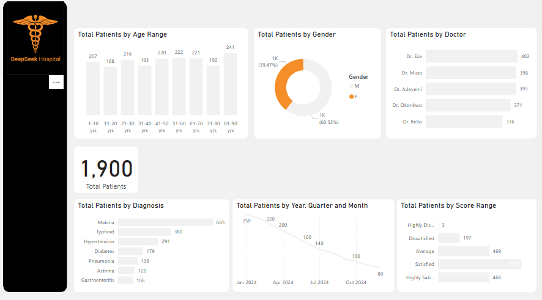

# 🏥 Hospital Patient Analytics Dashboard

## 📌 Project Overview
This Power BI dashboard analyzes patient data from a fictional hospital (DeepSeek Hospital). The dashboard provides insights into patient demographics, diagnoses, and satisfaction levels, helping medical teams make data-driven decisions to improve patient care.

The project showcases how hospitals can leverage data to monitor patient volumes, identify common health issues, and understand demographic trends over time.

## 🧰 Tools Used
- Power BI
- Power Query
- Excel (for mock data creation)

## 🗃 Dataset Description
- Total patients: 1,900
- Fields included:
  - Age Group
  - Gender
  - Diagnosis Type
  - Attending Doctor
  - Patient Satisfaction Score
  - Visit Date (Year, Quarter, Month)

## 📊 Dashboard Features
- Total Patients by Age Range
- Gender Distribution (Donut Chart)
- Patient Counts per Doctor
- Top Diagnoses (Bar Chart)
- Patient Trends Over Time
- Satisfaction Score Analysis

## 🔍 Key Insights
- 👩‍⚕️ Female patients make up ~60.5% of total visits
- 🦠 Malaria and Typhoid are the top 2 diagnoses
- 📉 Patient visits declined from Jan to Oct 2024
- 🤝 763 patients rated their experience as “Satisfied,” while 3 were “Highly Dissatisfied”
- 🧑‍⚕️ Dr. Eze and Dr. Musa had the highest patient volumes

## 🖼 Dashboard Preview

## 💼 Business Use Case
This dashboard would assist hospital managers, administrators, and healthcare professionals in:
- Resource allocation (staff, beds, medication)
- Monitoring performance by doctor
- Tracking seasonal or monthly patient visit trends
- Improving patient satisfaction based on feedback

---

📫 **Author**: Great Ukachukwu  
📍 **Location**: Nigeria  
📬 **Contact**: www.linkedin.com/in/great-ukachukwu-861b18192 / greatukachukwu@gmail.com 
📌 **Note**: This is a simulated healthcare dataset created for educational and portfolio purposes only.
