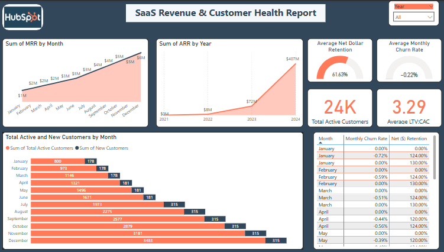

# 💻 SaaS Revenue and Customer Health Dashboard

## 📌 Project Overview
This Power BI project simulates a real-world SaaS (Software-as-a-Service) analytics dashboard, designed to monitor recurring revenue, customer churn, and retention metrics. Although inspired by the HubSpot platform design, the data and report were self-created for learning and demonstration purposes only.

The dashboard helps SaaS product teams, CFOs, and customer success managers visualize customer health and revenue performance with clarity and agility.

## 🧰 Tools Used
- Power BI (Data Modeling, DAX, Visual Design)
- Excel (Synthetic Data Generation)
- Power Query (Data Cleaning & M Transformation)

## 🗃 Dataset Description
- Simulated SaaS KPIs from 2021–2024
- Columns include: `Month`, `Churn Rate`, `Net Retention`, `MRR`, `ARR`, `Active Customers`, `New Customers`
- Created in Excel based on SaaS industry benchmark patterns

## 📈 Dashboard Features
- **Monthly Recurring Revenue (MRR)** Line Chart
- **Annual Recurring Revenue (ARR)** Projection Area Chart
- **Customer Retention Gauges** (Net Dollar Retention, Churn)
- **Active vs New Customers** Bar Chart
- **Customer Health Table** with metrics by month
- KPI Cards for:
  - Total Active Customers
  - Average LTV:CAC Ratio

## 🧠 Key Insights
- 📈 **MRR** grew steadily from $1M to $6M over 12 months.
- 🔮 **ARR** shows an exponential projection from $14M (2021) to $407M (2024).
- 📉 Average churn rate is negligible (~0.02%), simulating a strong product-market fit.
- 🧲 **Customer growth** accelerated from Q3 onward, with highest acquisition in **December** (3,483 users).
- 📊 LTV:CAC ratio of 3.29 suggests efficient customer acquisition with sustainable growth.

## 📊 Dashboard Preview

> *(Note: This report is a personal simulation using mock data and is not affiliated with HubSpot or any real company.)*

## 💼 Use Case
This project demonstrates a SaaS analytics approach useful for:
- Monthly performance reviews
- Investor reporting
- Customer success tracking
- Strategic retention decisions

## 🔗 Power BI Report Link
[🔗 View the Report (Coming Soon)](#)

---

📫 **Author**: Great Ukachukwu 
📍 **Location**: Nigeria  
📬 **Contact**: www.linkedin.com/in/great-ukachukwu-861b18192 | greatukachukwu@gmail.com 
🎓 **Note**: Built as a portfolio project using simulated data.

